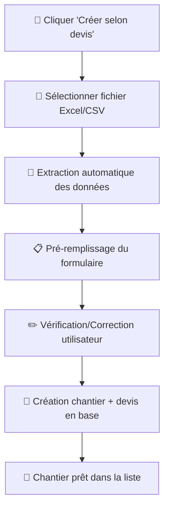

# 📄 Guide - Créer un Chantier depuis un Devis

## 🎯 Vue d'ensemble

Cette fonctionnalité permet de créer automatiquement un chantier dans ATARYS en extrayant les informations d'un fichier de devis (Excel/CSV). Le workflow complet automatise :

- ✅ Extraction des données client et chantier
- ✅ Calcul automatique des montants par famille d'ouvrages
- ✅ Pré-remplissage du formulaire de création
- ✅ Insertion en base de données (chantiers + devis)

---

## 🚀 Comment utiliser

### 1. Accéder à la fonctionnalité

1. Ouvrir l'application ATARYS
2. Aller dans **"Liste Chantiers"**
3. Cliquer sur **"➕ Créer Chantier"**
4. Dans la fenêtre qui s'ouvre, cliquer sur **"📄 Créer selon devis"**

### 2. Processus d'extraction

Une fois le bouton cliqué, le système :

1. **Ouvre une fenêtre de sélection de fichier**
   - Formats supportés : `.xlsx`, `.xls`, `.csv`
   - Sélectionner votre fichier de devis

2. **Lance l'extraction automatique**
   - Analyse la structure du fichier
   - Extrait les informations client
   - Calcule les montants par famille d'ouvrages
   - Calcule le total des heures

3. **Pré-remplit le formulaire**
   - Toutes les informations extraites apparaissent automatiquement
   - Un résumé s'affiche avec les données trouvées

### 3. Vérification et finalisation

1. **Vérifier les données pré-remplies** :
   - Informations client (nom, prénom, adresse, etc.)
   - Montant HT du devis
   - Nombre d'heures total
   - Familles d'ouvrages

2. **Compléter si nécessaire** :
   - Ajouter des informations manquantes
   - Corriger des données si besoin

3. **Créer le chantier** :
   - Cliquer sur "Créer le chantier"
   - Le chantier et le devis associé sont créés en base

---

## 📋 Données extraites automatiquement

### Informations Client
- Civilité (M., Mme, etc.)
- Nom et prénom
- Adresse complète
- Code postal et ville
- Email et téléphone

### Informations Chantier
- Numéro de devis
- Montant HT et TTC
- Déboursé matériaux
- Familles d'ouvrages (1x, 2x, 3x, etc.)
- Heures par famille
- Montants par famille
- Date de début et fin prévues

### Données Calculées
- **Total heures** : Somme de toutes les heures par famille
- **Montant par famille** : Répartition JSON des montants
- **Heures par famille** : Répartition JSON des heures
- **Référence dossier** : Générée automatiquement

---

## 🔧 Structure des fichiers de devis

### Format Excel recommandé

Le système recherche automatiquement :

```
LIGNE CLIENT : Contient nom, prénom, adresse
LIGNE MONTANTS : Montant HT, TTC, déboursé
COLONNES FAMILLES : 1x, 2x, 3x, 4x, 5x, 6x, 7x
HEURES PAR FAMILLE : Dans les colonnes correspondantes
```

### Exemple de structure
```
| Nom Client | Prénom | Adresse | ... | 1x | 2x | 3x | Total |
|------------|--------|---------|-----|----|----|----|----- -|
| Dupont     | Jean   | 123 Rue | ... | 25h| 50h| 0h | 75h   |
|            |        |         | ... |5000|10K | 0  | 15000 |
```

---

## ⚡ Avantages

### Gain de temps
- **90% de réduction** du temps de saisie
- Pas d'erreurs de recopie
- Calculs automatiques

### Précision
- Extraction directe depuis le devis source
- Calculs vérifiés automatiquement
- Cohérence garantie avec le devis

### Traçabilité
- Lien direct devis ↔ chantier
- Historique des modifications
- Données JSON pour analyses

---

## 🛠️ Dépannage

### Problèmes courants

**❌ "Aucun fichier sélectionné"**
- Vérifier que vous avez bien sélectionné un fichier
- Formats supportés : .xlsx, .xls, .csv

**❌ "Échec de l'extraction"**
- Vérifier la structure du fichier Excel
- S'assurer que les colonnes familles (1x, 2x, etc.) sont présentes
- Vérifier que les données client sont dans le bon format

**❌ "Erreur de connexion"**
- Vérifier que le backend est démarré
- Redémarrer l'application si nécessaire

### Logs de débogage

Les logs sont disponibles dans :
- **Frontend** : Console du navigateur (F12)
- **Backend** : Terminal où l'application tourne
- **Fichiers** : `logs/atarys.log`

---

## 📊 Données créées en base

### Table `chantiers`
```sql
INSERT INTO chantiers (
  nom, prenom, civilite, email, telephone,
  adresse, code_postal, ville,
  montant_ht_devis, nombre_heures_total,
  famille_ouvrages, reference_chantier,
  dossier_onedrive, etat_id, progression
) VALUES (...)
```

### Table `devis`
```sql
INSERT INTO devis (
  chantier_id, numero_devis, montant_ht, montant_ttc,
  debourse_materiaux, famille_ouvrages,
  montant_par_famille, heures_par_famille,
  fichier_excel_origine, date_creation
) VALUES (...)
```

---

## 🎉 Workflow complet



---

## 📞 Support

En cas de problème :
1. Vérifier les logs (console navigateur + backend)
2. Tester avec un fichier de devis simple
3. Vérifier que toutes les colonnes requises sont présentes
4. Redémarrer l'application si nécessaire

**Cette fonctionnalité transforme la création de chantiers en un processus de quelques clics au lieu de plusieurs minutes de saisie manuelle !** 🚀 