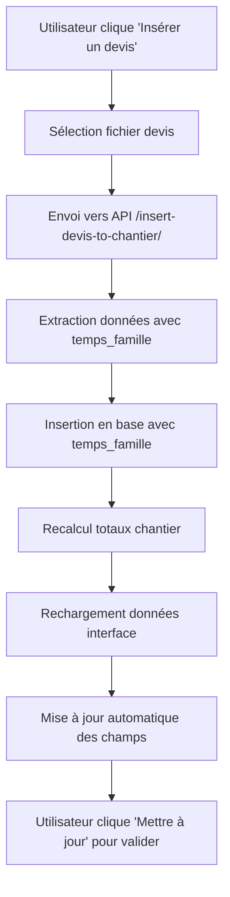

# 🔧 CORRECTIONS - INSERTION DEVIS ET TEMPS_FAMILLE

## 🎯 **Problèmes identifiés et résolus**

### 1. **Problème Backend : `temps_famille` non inclus dans les requêtes SQL**
- ✅ **Corrigé** : Ajout de `temps_famille` dans toutes les requêtes `INSERT INTO devis`
- ✅ **Fichiers modifiés** : `backend/app/routes/devis.py` et `backend/app/routes/devis_extraction.py`

### 2. **Problème Frontend : Interface utilisateur confuse**
- ✅ **Avant** : Bouton toggle + checkbox = confusion
- ✅ **Après** : Bouton direct "Insérer un devis" + bouton "Mettre à jour" séparés

### 3. **Problème : Champs non mis à jour après insertion**
- ✅ **Corrigé** : Ajout de `loadSelectedChantierData()` après insertion réussie

---

## 🛠️ **Corrections apportées**

### **Frontend (`frontend/src/pages/ListeChantiers.jsx`)**

#### 1. **Nouvelle fonction séparée pour l'insertion de devis**
```javascript
const handleInsertDevis = async () => {
    // Sélectionne directement le fichier et l'insère
    // Recharge les données du chantier après insertion
    await loadSelectedChantierData(); // 🔑 Clé pour mise à jour des champs
    await loadChantiers();
};
```

#### 2. **Simplification de l'interface**
- **Bouton "Insérer un devis"** → Déclenche directement `handleInsertDevis()`
- **Bouton "Mettre à jour le chantier"** → Ne fait que la mise à jour + ferme la modal
- **Suppression de la checkbox confuse** en bas

#### 3. **Suppression de l'état `insertDevis`**
- Plus de logique conditionnelle complexe
- Interface plus claire et intuitive

### **Backend (Requêtes SQL)**

#### 1. **`backend/app/routes/devis.py`**
```sql
INSERT INTO devis (
    chantier_id, numero_devis, date_devis, montant_ht, montant_ttc,
    debourse_materiaux, famille_ouvrages, fichier_excel_origine,
    date_creation, actif, montant_par_famille, temps_famille, temps_total  -- ✅ Ajouté
) VALUES (?, ?, ?, ?, ?, ?, ?, ?, ?, ?, ?, ?, ?)
```

#### 2. **`backend/app/routes/devis_extraction.py`**
```sql
INSERT INTO devis (
    -- ... mêmes colonnes avec temps_famille inclus
    temps_famille,  -- ✅ JSON des heures par famille
    temps_total     -- ✅ Somme totale des heures
) VALUES (..., json.dumps(extracted_data.get('temps_famille', {})), ...)
```

---

## 🧪 **Tests effectués**

### 1. **Test insertion manuelle en base**
```bash
cd backend
python debug_devis.py  # ✅ Insertion réussie
```

### 2. **Vérification structure base de données**
- ✅ Colonne `temps_famille` existe (REAL)
- ✅ Données JSON stockées correctement
- ✅ Valeurs lues et parsées correctement

### 3. **Vérification routes API**
- ✅ Route `/api/insert-devis-to-chantier/<id>` existe
- ✅ Blueprint `devis_extraction_bp` enregistré
- ✅ Import `extraction_devis_wrapper` fonctionne

---

## 📋 **Instructions pour tester**

### 1. **Démarrer le serveur**
```bash
cd backend
python run.py
```

### 2. **Tester l'interface**
1. Aller sur l'interface frontend
2. Sélectionner un chantier existant
3. Cliquer sur "Modifier" 
4. Cliquer sur **"📄 Insérer un devis"** (bouton en haut)
5. Sélectionner un fichier Excel/CSV de devis
6. Vérifier que les champs se mettent à jour automatiquement
7. Cliquer sur **"Mettre à jour le chantier"** pour valider et fermer

### 3. **Vérifier en base de données**
```sql
SELECT 
    id, numero_devis, temps_famille, temps_total, montant_ht 
FROM devis 
ORDER BY date_creation DESC 
LIMIT 5;
```

---

## 🔄 **Flux de travail corrigé**



---

## ✅ **Résultats attendus**

1. **Insertion directe** : Bouton "Insérer un devis" fonctionne immédiatement
2. **Champs mis à jour** : Montant HT et temps total se mettent à jour automatiquement
3. **Base de données alimentée** : Colonne `temps_famille` contient les données JSON
4. **Interface claire** : Plus de confusion entre les boutons
5. **Validation séparée** : "Mettre à jour le chantier" ne fait que sauvegarder et fermer

---

## 🚨 **Dépannage**

Si le problème persiste :

1. **Vérifier les logs serveur** : `python run.py` avec logs activés
2. **Vérifier console navigateur** : F12 → Console pour erreurs JavaScript
3. **Tester route API directement** : Postman/curl sur `/api/insert-devis-to-chantier/1`
4. **Vérifier base de données** : SQLite Browser pour voir les insertions

---

*Corrections appliquées le 30/06/2025* 